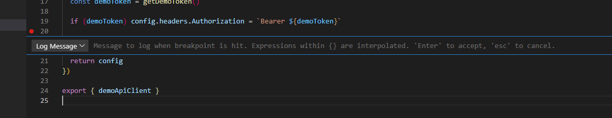

# Misc

(To be sorted.)

## Satisfied for calculating union types without manual type guards

https://hackernoon.com/introducing-the-satisfy-operator-in-typescript
https://www.freecodecamp.org/news/typescript-satisfies-operator/

## Typescript exhaust checking

```typescript
type AddressProcess = "CsvFile" | "Preaddressed" | "KeywordReplacement"

const handleAddressProcessSwitch = (addressProcess: AddressProcess) => {
  const exhaustiveCheck = (param: never) => {} // Could also be defined in the component body or imported from a lib/helper.

  switch (addressProcess) {
    case "CsvFile":
      console.log("CsvFile")
      break
    case "Preaddressed":
      console.log("Preaddressed")
      break
    case "KeywordReplacement":
      console.log("KeywordReplacement")
      break
  }

  exhaustiveCheck(addressingType)
}

const handleAddressProcessIf = (addressProcess: AddressProcess) => {
  if (addressProcess === "CsvFile") console.log("CsvFile")
  else if (addressProcess === "Preaddressed") console.log("Preaddressed")
  else if (addressProcess === "KeywordReplacement") console.log("KeywordReplacement")

  const _exhaustiveCheck: never = addressProcess
  return _exhaustiveCheck
}

const number = setNumber(object.addressProcess)
```

[Source - typescriptlang.org](https://www.typescriptlang.org/docs/handbook/2/narrowing.html#exhaustiveness-checking)

## Remove unnecessary React Fragments

You might think that leaving an extra indentation of React Fragments is no big deal. But as the component grows you do have to deal with yet another level of indentation. It will make the reading of the code harder.

## Take care to write clean code

Remember that your code will be read much more than it will be written. So take your time to make it readable.

## Logpoints

A Logpoint is a variant of a breakpoint that does not "break" into the debugger but instead logs a message to the console. Logpoints are especially useful for injecting logging while debugging production servers that cannot be paused or stopped.
A Logpoint is represented by a "diamond" shaped icon. Log messages are plain text but can include expressions to be evaluated within curly braces ('{}').



[Source - Visual Studio Docs](https://code.visualstudio.com/docs/editor/debugging)

## Destructure data

Be careful when destruction variables. If you destructure an object that is null or undefined you will get a runtime error. In the case of axios - there is no data object returned on timeouts, network erros etc.

```typescript
const { data } = await axios.get(url)
```

# Troubleshooting tips

### Check the node version on the server.

With Azure app services you will do that under the app servier settings.
`WEBSITE_NODE_DEFAULT_VERSION`

### Run the app in production mode locally

See if you can reproduce the error locally. Or if it's just showing in production mode.

### Clear the cache

`NPM -cache clean`

# CSS

## Flex height stretch!

A flexbox of height 4 rem will schrink if needed.
When the browser window schrinks or a mobile might be too small for the content.

The flex-basis could set this value to be higher - but it would still shrink.
To prevent this - set padding to match the size of the div - or set min-height instead of just height.

In other words, the defaults settings on the flex items are:
• min-width: auto (with a horizontal main axis/row-direction)
• min-height: auto (with a vertical main axis/column-direction)

And we need to take care of that, a flex item cannot be smaller than the
size of its content along the main axis. That’s because the browser usually calculates
the default min-width or min-height based on the content-based minimum size.

[Source - Medium - The crazy coder](https://medium.com/the-crazy-coder/the-mystery-of-css-flex-layout-items-shrinking-8748145e96d9)
